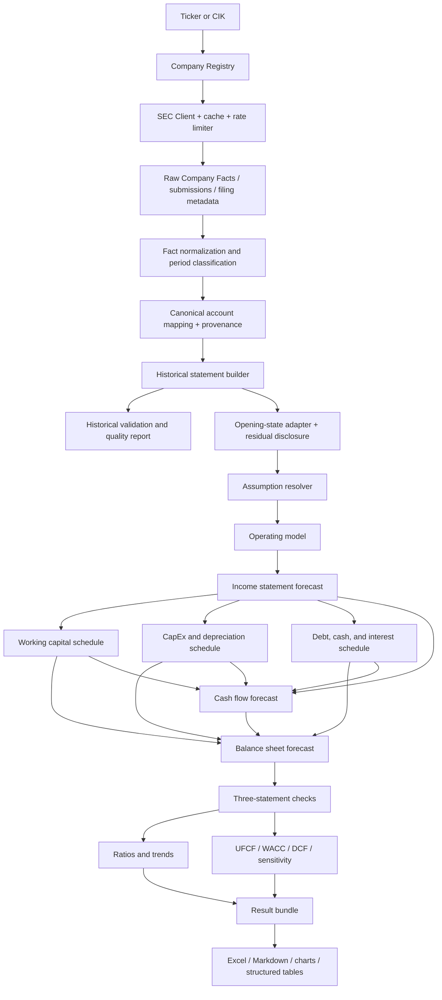

# Architecture

Company-specific operating logic implements the `OperatingModel` interface. See
[`business_driver_models.md`](business_driver_models.md) for the optional COST warehouse and
membership model; the default remains the generic top-down model.

## Product boundary

The project is a semi-automated, research-oriented financial modelling and valuation framework for non-financial U.S. public companies. Automation handles retrieval, standardization, calculations, linked statements, valuation, checks, and exports. Research judgment remains explicit in forecast assumptions and company-specific operating logic.

The MVP is a library-first Python 3.11+ package with a thin CLI. Notebooks demonstrate workflows but contain no core business logic.

## Architectural principles

1. Raw SEC facts are immutable and cached.
2. Reported facts and canonical model accounts are separate representations.
3. Every standardized value retains field-level lineage and mapping confidence.
4. Assumptions are centralized, typed, versionable, and never hidden in formulas.
5. Supporting schedules drive statements; statements are not forecast independently.
6. Each model stage accepts typed inputs and returns immutable or clearly owned results.
7. Missing data, fallbacks, derived values, plugs, and convergence are disclosed.
8. Checks are structured outputs and can block export when configured.
9. Industry-specific logic is added through interfaces, not conditionals scattered across the core.
10. Public artifacts contain only public SEC data, synthetic sample data, and user-authored assumptions.

## End-to-end flow



## Recommended repository structure

```text
financial-modelling-valuation/
├── README.md
├── LICENSE
├── pyproject.toml
├── .gitignore
├── CHANGELOG.md
├── config/
│   ├── default.yaml
│   ├── account_mapping.yaml
│   ├── ratio_definitions.yaml
│   └── model_config.example.yaml
├── docs/
│   ├── architecture.md
│   ├── data_model.md
│   ├── reference_model_analysis.md
│   ├── methodology.md
│   ├── modelling_conventions.md
│   ├── three_statement_linkage.md
│   ├── dcf_methodology.md
│   ├── limitations.md
│   ├── mvp_scope.md
│   └── roadmap.md
├── src/fmva/
│   ├── __init__.py
│   ├── api.py
│   ├── cli.py
│   ├── exceptions.py
│   ├── logging.py
│   ├── config/
│   │   ├── models.py
│   │   └── loader.py
│   ├── sec/
│   │   ├── client.py
│   │   ├── cache.py
│   │   ├── rate_limit.py
│   │   ├── company_registry.py
│   │   └── filing_selector.py
│   ├── data/
│   │   ├── models.py
│   │   ├── period_classifier.py
│   │   ├── fact_normalizer.py
│   │   ├── account_mapper.py
│   │   ├── statement_builder.py
│   │   └── quality.py
│   ├── forecasting/
│   │   ├── assumptions.py
│   │   ├── operating.py
│   │   ├── income_statement.py
│   │   ├── working_capital.py
│   │   ├── fixed_assets.py
│   │   ├── debt_cash.py
│   │   ├── equity.py
│   │   ├── balance_sheet.py
│   │   ├── cash_flow.py
│   │   └── three_statement.py
│   ├── analysis/
│   │   ├── ratios.py
│   │   └── trends.py
│   ├── valuation/
│   │   ├── free_cash_flow.py
│   │   ├── wacc.py
│   │   ├── terminal_value.py
│   │   ├── dcf.py
│   │   └── sensitivity.py
│   ├── checks/
│   │   ├── models.py
│   │   ├── historical.py
│   │   ├── statements.py
│   │   └── valuation.py
│   └── output/
│       ├── excel.py
│       ├── markdown.py
│       ├── charts.py
│       └── result.py
├── tests/
│   ├── unit/
│   ├── integration/
│   ├── contract/
│   └── fixtures/
├── notebooks/
│   ├── 01_sec_data.ipynb
│   ├── 02_historical_analysis.ipynb
│   ├── 03_forecast_model.ipynb
│   └── 04_dcf_and_outputs.ipynb
├── examples/
│   └── wmt/
│       ├── model_config.yaml
│       └── README.md
├── data/
│   ├── sample/
│   └── README.md
└── outputs/
    └── .gitkeep
```

This differs from the initial proposal in several ways:

- SEC transport concerns are isolated from accounting normalization.
- Configuration code is separated from user configuration files.
- All forecast modules live under one `forecasting` boundary.
- Check result models are shared and checks are split by lifecycle stage.
- Output returns a single `ModelResult` bundle rather than exporters reaching into model internals.
- Tests distinguish unit, integration, contract, and fixtures.
- Raw/interim/processed user data directories are not committed by default; cache location is configurable and ignored.

## Major components

### SEC access layer

`SecClient` owns User-Agent validation, timeouts, retry/backoff, rate limiting, conditional requests when possible, and a disk cache. It exposes raw JSON responses without accounting interpretation. A missing or placeholder User-Agent is a configuration error for live requests.

`CompanyRegistry` resolves ticker/CIK using the SEC ticker registry and enriches it with submissions metadata. `FilingSelector` classifies 10-K, 10-K/A, accession, filed date, fiscal year end, form, and period.

### Normalization layer

`FactNormalizer` converts SEC facts into typed `ReportedFact` records, normalizes units, assigns period semantics, and preserves duplicates. `AccountMapper` ranks candidate facts using configured tag priority, form/period compatibility, filing recency, duration/instant rules, and direct-versus-derived status. `StatementBuilder` selects one canonical observation per account/period and records selection decisions.

### Assumption layer

Assumptions are loaded into typed models with values by forecast period, units, scenario, source/origin, and validation bounds. A resolver can generate a draft from historical averages, but generated assumptions remain visible and editable.

### Forecast engine

The forecast engine executes an explicit dependency order. The default top-down operating model produces revenue; a protocol allows a bottom-up implementation to return the same `OperatingForecast` contract.

Debt/cash circularity is handled by a documented solver policy:

1. Calculate operating forecast and preliminary interest using opening balances.
2. Build preliminary statements and pre-financing ending cash.
3. Apply minimum-cash borrowing/repayment rules.
4. Recalculate interest on average balances.
5. Repeat only when enabled, with maximum iterations and convergence tolerance.

The result records iteration count, final delta, and convergence status. No global hidden state or spreadsheet-style iterative calculation is allowed.

### Analysis and valuation

Ratios are driven by declarative definitions and applicability rules. DCF consumes forecast statements and valuation assumptions, not raw SEC data. Sensitivity analysis calls the valuation function with changed inputs; it does not perturb the final share price directly.

### Checks

Every check returns:

```python
CheckResult(
    name="balance_sheet",
    actual=assets,
    expected=liabilities_and_equity,
    difference=assets - liabilities_and_equity,
    tolerance=1e-6,
    status=CheckStatus.PASS,
    severity=CheckSeverity.ERROR,
    message=None,
    context={"period": "FY2029E"},
)
```

Checks cover source completeness, duplicate selection, units, sign conventions, balance sheet, cash, retained earnings, PP&E, debt, UFCF, discount factors, terminal value bounds, and equity bridge.

### Output layer

`ModelResult` contains tables, metadata, checks, valuation, sensitivities, charts, and limitations. Exporters are pure consumers. Excel outputs include a Sources/Audit sheet and expose assumptions, checks, and any plug. Markdown reports link conclusions to model tables and disclose quality limitations.

## Public/private data policy

- The reference Excel and textbook remain local and are excluded by exact name and reference-file patterns.
- SEC public data may be redistributed only in small reproducible samples with accession/source metadata.
- Live SEC caches and generated company outputs are ignored by default.
- No analyst names, proprietary ratings, private assumptions, or paid data are committed.
- Synthetic fixtures are preferred for unit tests; a small pinned SEC fixture supports integration tests.

## Extension points

- `OperatingModel` for company/industry revenue drivers.
- `DataProvider` for uploaded CSV/Excel or future public sources.
- `AccountMappingProfile` for industry-specific canonical mappings.
- `DebtPolicy` for revolvers, maturities, or cash sweeps.
- `TerminalValueMethod` for additional valuation methods.
- `ReportRenderer` for additional output formats.

Financial institutions require a separate model profile and are not a subclass of the industrial three-statement model by default.
