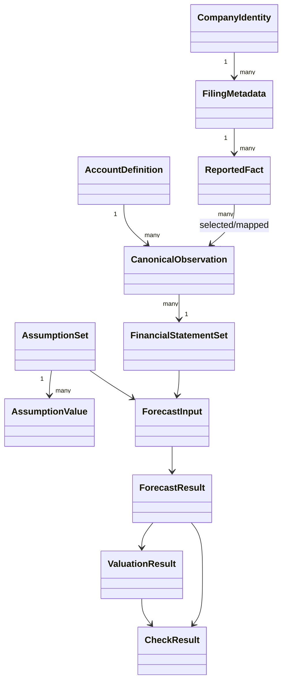

# Data Model

## Conventions

- Currency: USD millions after normalization, except per-share values and share prices.
- Shares: millions of shares.
- Expenses: stored as positive magnitudes in canonical statements and subtracted in calculations.
- Assets, liabilities, and equity: positive balances.
- CapEx, debt repayment, and dividends: positive in schedules; converted to negative cash flows in the CFS.
- Historical periods: `FY` only for the MVP statement build. Quarter, YTD, and LTM facts are retained but not mixed into annual statements.
- Forecast periods: `FY{year}E` with an explicit `is_forecast` flag; the label is presentation only.
- Tolerance: scaled checks use both absolute and relative tolerance where appropriate.

## Core entities



### CompanyIdentity

| Field | Type | Notes |
|---|---|---|
| ticker | str | Uppercase current ticker. |
| cik | str | Zero-padded 10-digit CIK. |
| name | str | SEC registrant name. |
| fiscal_year_end | str or null | MMDD. |
| sic | str or null | SEC SIC code. |
| sic_description | str or null | Human-readable industry. |
| entity_type | str or null | SEC entity type. |
| filings_url | str | SEC submissions or browse URL. |
| source_accessed_at | datetime | Registry retrieval time. |

### FilingMetadata

| Field | Type | Notes |
|---|---|---|
| accession_number | str | Stable filing identifier. |
| form | str | `10-K`, `10-K/A`, etc. |
| filed_date | date | Filing date. |
| report_date | date | Fiscal period end. |
| fiscal_year | int or null | Fiscal year if identified. |
| fiscal_period | enum | FY, Q1, Q2, Q3, Q4, YTD, LTM, OTHER. |
| is_amendment | bool | True for amended form. |
| primary_document | str or null | Filing document. |
| filing_url | str | Direct SEC URL. |

### ReportedFact

`ReportedFact` represents one source observation before canonical account selection.

| Field | Type | Notes |
|---|---|---|
| taxonomy | str | Usually `us-gaap`, `dei`, or custom namespace. |
| tag | str | XBRL concept. |
| label | str or null | Source label if available. |
| value | Decimal | Original numeric value. |
| unit | str | Original unit, e.g. USD, shares, USD/shares. |
| start_date | date or null | Null for instant facts. |
| end_date | date | Period end/instant date. |
| frame | str or null | SEC frame. |
| form | str | Source form. |
| accession_number | str | Source filing. |
| filed_date | date | Filing date. |
| fiscal_year | int or null | Model fiscal year derived from the annual fact's period end year. |
| sec_fiscal_year | int or null | Original SEC `fy`, retained because comparative facts can carry the filing's fiscal focus rather than the represented period. |
| fiscal_period | enum | Classified period type. |
| fact_kind | enum | INSTANT or DURATION. |
| is_amendment | bool | Amendment marker. |
| raw_payload_ref | str | Cache-relative pointer or digest. |

### FieldProvenance

Every canonical value has provenance:

| Field | Type | Notes |
|---|---|---|
| source_tag | str or null | Selected source concept. |
| source_filing | str or null | Accession number. |
| filing_date | date or null | Filing date. |
| fiscal_period | str | Period classification. |
| unit | str | Normalized unit. |
| confidence | enum | HIGH, MEDIUM, LOW, MISSING. |
| selection_method | enum | DIRECT, FALLBACK, DERIVED, MANUAL, MISSING. |
| fallback_rank | int or null | Configured tag rank. |
| is_restated | bool | Later filing supersedes an earlier value. |
| formula | str or null | Derivation expression for derived values. |
| warnings | list[str] | Unit, sign, duplicate, or period warnings. |

### CanonicalObservation

| Field | Type | Notes |
|---|---|---|
| account | str | Canonical name. |
| period | FiscalPeriod | Annual historical period. |
| value | Decimal or null | USD millions, shares millions, or per-share. |
| provenance | FieldProvenance | Required even when missing. |

### FinancialStatementSet

Contains statement DataFrames with canonical account index and typed period columns, plus a metadata table of the same logical shape. Values and metadata are not stored in pandas `attrs`; they are separate serializable objects.

### Historical snapshot schema

`HistoricalStatements` can be serialized to a strict JSON document with `schema_version: 1`.
The document contains:

- optional public company/fixture metadata;
- statement names, canonical account indexes, fiscal-year columns, and JSON-safe values;
- decimal canonical observations;
- complete `FieldProvenance` for direct, fallback, derived, and missing values; and
- structured quality issues.

Missing DataFrame cells are written as JSON `null`, never non-standard `NaN`. SEC request
headers, contact-bearing User-Agents, cache locations, and raw response metadata are outside the
schema. Unknown schema versions and malformed payloads fail with `HistoricalDataError` rather
than being interpreted heuristically.

### AssumptionValue and AssumptionSet

| Field | Type | Notes |
|---|---|---|
| key | str | Canonical assumption name. |
| period | int or null | Null for scalar assumptions. |
| value | Decimal, int, bool, or str | Typed value. |
| unit | enum | PERCENT, DAYS, USD_MILLIONS, SHARES_MILLIONS, MULTIPLE, YEARS. |
| scenario | str | Base, bull, bear, or user-defined. |
| origin | enum | USER, HISTORICAL_AVERAGE, COMPANY_GUIDANCE, MARKET_INPUT, DEFAULT. |
| source_note | str or null | Research rationale or source. |
| editable | bool | True for model inputs. |

### ForecastResult

Contains income statement, balance sheet, cash flow statement, working-capital schedule, fixed-asset schedule, debt/cash schedule, equity schedule, ratios, and solver diagnostics. Each table uses the same forecast period axis.

### CheckResult

| Field | Type | Notes |
|---|---|---|
| name | str | Stable machine-readable check key. |
| actual | float or null | Observed value. |
| expected | float or null | Expected value. |
| difference | float or null | Actual minus expected. |
| tolerance | float | Applied tolerance. |
| status | enum | PASS, WARN, FAIL, NOT_APPLICABLE. |
| severity | enum | INFO, WARNING, ERROR. |
| message | str or null | Clear action or limitation. |
| context | dict | Period, account, and location. |

## Account mapping schema

`config/account_mapping.yaml` should be declarative:

```yaml
accounts:
  revenue:
    statement: income_statement
    fact_kind: duration
    sign: positive
    required: true
    unit_type: currency
    accepted_tags:
      - tag: RevenueFromContractWithCustomerExcludingAssessedTax
        priority: 10
      - tag: SalesRevenueNet
        priority: 20
      - tag: Revenues
        priority: 30
      - tag: NetSales
        priority: 40
    derivation: null
    description: Revenue from ordinary activities.
```

Mapping selection considers more than tag priority:

1. Correct fact kind and unit.
2. Correct annual period and duration.
3. 10-K over other forms for annual history.
4. Latest valid restatement for the same fiscal period.
5. Direct canonical tag before fallback tag.
6. Derivation only when configured and components are sufficiently reliable.
7. Missing value with an explicit quality record if no candidate passes.

## MVP canonical accounts

The canonical dictionary should include the user's requested accounts. The following table adds modelling behavior and requiredness guidance.

### Income statement

| Account | Kind | MVP requirement | Notes |
|---|---|---|---|
| revenue | Flow | Required | Primary operating revenue. |
| cogs | Flow | Required or derived | May be derived from revenue and gross profit with disclosure. |
| gross_profit | Flow | Derived/optional source | Revenue less COGS. |
| selling_general_admin | Flow | Required for forecast if material | Combined SG&A accepted in MVP. |
| research_and_development | Flow | Optional | Applicability flag required. |
| depreciation_and_amortization | Flow | Required for DCF; may use CFS source | Avoid double counting if embedded in costs. |
| operating_income | Flow | Required or derived | EBIT proxy with definition disclosed. |
| interest_expense | Flow | Optional historical, required forecast | Gross interest preferred. |
| interest_income | Flow | Optional | Separate when available. |
| income_before_tax | Flow | Required or derived |  |
| income_tax | Flow | Required | Positive expense magnitude. |
| net_income | Flow | Required | Consolidated net income. |
| minority_interest | Flow | Optional | Non-controlling interest allocation. |
| net_income_attributable_to_parent | Flow | Required or derived |  |
| diluted_eps | Per-share flow | Required if available | USD/share. |
| diluted_shares | Flow/weighted average | Required for implied price | Shares millions. |

### Balance sheet

| Account group | Canonical accounts |
|---|---|
| Liquidity | cash_and_equivalents, short_term_investments |
| Working capital assets | accounts_receivable, inventory, other_current_assets, total_current_assets |
| Long-lived assets | property_plant_equipment, goodwill, intangible_assets, other_noncurrent_assets, total_assets |
| Working capital liabilities | accounts_payable, accrued_liabilities, other_current_liabilities, total_current_liabilities |
| Debt and leases | short_term_debt, current_lease_liabilities, long_term_debt, noncurrent_lease_liabilities |
| Other liabilities | deferred_tax_liabilities, other_noncurrent_liabilities, total_liabilities |
| Equity | common_stock, additional_paid_in_capital, retained_earnings, accumulated_other_comprehensive_income, treasury_stock, minority_interest, total_equity |

`total_liabilities_and_equity` should be added as a derived check account even though it is not a primary requested account.

### Cash flow statement

| Group | Canonical accounts |
|---|---|
| Operating | net_income, depreciation_and_amortization, stock_based_compensation, deferred_taxes, change_in_accounts_receivable, change_in_inventory, change_in_accounts_payable, change_in_other_working_capital, cash_from_operations |
| Investing | capital_expenditures, acquisitions, asset_disposals, cash_from_investing |
| Financing | debt_issuance, debt_repayment, share_issuance, share_repurchases, dividends_paid, cash_from_financing |
| Reconciliation | fx_effect, net_change_in_cash |

Cash-flow change accounts follow the model presentation convention, not the source sign. Raw signs are retained in provenance.

## Period classification and annual selection

Annual facts must satisfy rules appropriate to their kind:

- Instant facts: end date equals fiscal year end within a documented tolerance.
- Duration facts: period length is approximately one fiscal year and form is 10-K/10-K/A.
- `fp=FY` is evidence, not the sole criterion.
- Quarter and YTD facts remain stored but cannot be selected as annual history.
- A 10-K/A replaces a prior fact only when it contains a relevant corrected fact; amendment status alone does not invalidate the original filing.
- If a later 10-K presents a restated comparative year, the later reported value is preferred and marked `is_restated=true`.
- Annual duplicates are grouped by period end date before selecting the latest filing; SEC `fy` is never the sole grouping key.

## Missing and derived data policy

- Never convert every missing value to zero.
- Optional accounts may be zero only when the source presentation or a user assumption supports zero.
- Derived totals require visible formulas and component completeness checks.
- Fallback tags lower confidence.
- Manual overrides create a new provenance record and do not delete the SEC-selected value.
- Outputs show missingness and quality flags separately from numeric tables.

## Ratio definition model

Ratios should be declared with:

```yaml
current_ratio:
  numerator: total_current_assets
  denominator: total_current_liabilities
  unit: x
  applicability: non_financial
  zero_denominator: warn_and_null
  required_accounts: [total_current_assets, total_current_liabilities]
  description: Current assets divided by current liabilities.
```

Definitions also specify average-balance usage, fiscal-day convention, sign expectations, and outlier thresholds.

## Business driver schedule

Company-specific operating models expose a rows-by-fiscal-years DataFrame alongside the standard
financial schedules. Driver labels are explicit, units are encoded by documented conventions, and
the schedule must include `total_revenue` so the check suite can reconcile it to the income
statement. The first implementation uses warehouse counts, comparable sales, new-store
productivity, merchandise revenue, paid-member equivalents, effective fees, membership-fee
revenue, and merchandise COGS. These are researcher inputs or calculations, not SEC facts; they do
not inherit SEC field-level provenance.

## Historical business KPI contract

Business KPIs that do not belong in the canonical three statements use a separate long-form table:

| Field | Purpose |
|---|---|
| metric / dimension | Canonical KPI and business, product, geography, or cohort member. |
| fiscal_year / value / unit | Period and typed observation. |
| source_name / source_url / source_document | Direct review path to the disclosure. |
| filing_date | Date of the source filing or report. |
| confidence | HIGH, MEDIUM, or LOW. |
| is_direct / is_restated | Directness and comparative-period restatement flags. |
| notes | Scope, definition, or comparability caveat. |

Duplicate metric-dimension-year keys, invalid booleans, absent source URLs, and unsupported units or
confidence labels fail loudly. Consolidated segment-revenue and segment-COGS totals are checked
against standardized historical statements when present.
