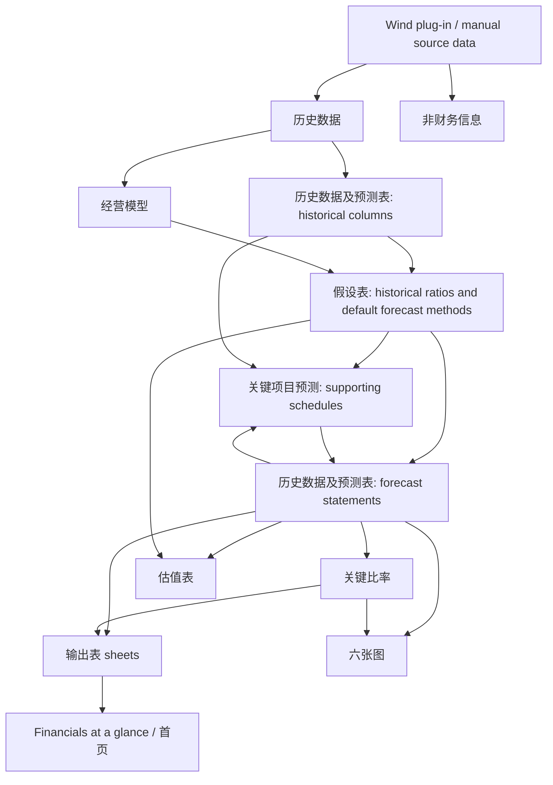

# Reference Model Analysis

## Purpose and review boundary

This document records a structural review of the internal reference workbook `通裕重工-中信证券A股标准估值模型20231023.xlsx`. The workbook is an architectural reference only. Its branding, company data, proprietary plug-in behavior, and original file must not be published in the open-source repository.

The review was performed on 2026-07-13 by reading the workbook package, worksheet values, cached formula results, formulas, defined names, relationships, charts, controls, and calculation settings. The preferred workbook reader could not import the file because its graphics stack failed on the workbook's complex drawing objects. Therefore, the inventory below is based on direct OOXML inspection. Formula text and cached values are available, but the workbook was not recalculated in a clean Excel session.

## Workbook inventory

The workbook contains 17 worksheets and approximately 9,691 formula cells. All sheets are visible except `校验警告`, which is hidden.

| # | Sheet | Visibility | Used range | Role |
|---:|---|---|---|---|
| 1 | 首页 | Visible | A8:P52 | Cover, global parameters, company/model metadata, navigation, instructions, and warning conventions. |
| 2 | Financials at a glance | Visible | B1:G143 | English summary of headline financials, three statements, ratios, and forecast outputs. |
| 3 | 历史数据 | Visible | A1:I276 | Raw/imported A-share financial statement taxonomy and historical values; designed for Wind plug-in population. |
| 4 | 经营模型 | Visible | A1:O59 | Company-specific bottom-up revenue and cost build by product/business line. |
| 5 | 假设表 | Visible | A1:R156 | Central assumption layer for P&L, working capital, investing, debt, equity, and valuation. |
| 6 | 关键项目预测 | Visible | A1:O352 | Supporting schedules: fixed assets, depreciation, construction in progress, leases, other long-lived assets, equity financing, impairments, working capital, cash, debt, and interest. |
| 7 | 历史数据及预测表 | Visible | A2:T235 | Core historical-plus-forecast balance sheet, income statement, cash flow statement, notes, and model checks. |
| 8 | 估值表 | Visible | B2:W70 | DCF, DDM, trading-multiple methods, WACC build, and a WACC/growth sensitivity grid. |
| 9 | 非财务信息 | Visible | A1:F42 | Company master data and non-financial metadata, largely sourced from Wind. |
| 10 | 关键比率 | Visible | A1:U68 | Per-share, profitability, capital structure, liquidity, leverage, efficiency, and cash-flow ratios. |
| 11 | 输出表-首页用表 | Visible | A1:G24 | Condensed headline output used by the cover/summary. |
| 12 | 输出表-利润表 | Visible | A1:G26 | Presentation-ready income statement output. |
| 13 | 输出表-资产负债表 | Visible | A1:G29 | Presentation-ready balance sheet output. |
| 14 | 输出表-现金流量表 | Visible | A1:G17 | Presentation-ready cash flow output. |
| 15 | 输出表-财务指标 | Visible | A1:G19 | Presentation-ready KPI output. |
| 16 | 六张图 | Visible | A2:J42 | Six chart source blocks and charts covering revenue mix, operations, expenses, profitability, cash flow, and efficiency. |
| 17 | 校验警告 | Hidden | A1:C1 | Intended warning output with columns for description, category, and cell location; it contains only headers in this copy. |

## Model layering and data flow

The two-way links between `关键项目预测` and `历史数据及预测表` are deliberate. Supporting schedules drive statement balances, while statement outputs provide opening balances and cash flows for subsequent schedules. The workbook also enables iterative calculation, which confirms that at least one circular chain is expected.

## Historical data organization

`历史数据` is a broad A-share reporting taxonomy rather than a normalized analytical schema. It includes industrial, banking, and insurance rows in one sheet and uses Wind-style codes such as `OPER_INC`, `SELL_EXP`, and `TTL_PROF`. Historical data flows into the combined historical/forecast sheet, where rows are reorganized into balance sheet, income statement, cash flow statement, notes, and auxiliary data.

Useful design ideas:

- Keep raw source concepts distinct from canonical model accounts.
- Preserve source codes and descriptions for auditability.
- Separate reported values from model-derived values.
- Use one common annual time axis for historical and forecast columns.

Changes required for the U.S. project:

- Replace Wind identifiers with SEC concepts and filing metadata.
- Do not combine financial-company and industrial-company taxonomies in the MVP.
- Store field-level provenance rather than only a row-level source code.
- Resolve restatements and duplicate XBRL facts before statement construction.

## Operating model

`经营模型` is a company-specific bottom-up build. It divides revenue and cost into wind-power shafts, other forgings, castings, modular wind equipment, structures/equipment, and other products. Some segments use operational drivers such as volume, mix, selling price, and unit cost. Segment totals feed the central assumption and forecast layers.

Reusable principle: the framework needs a stable `OperatingModel` interface with a simple top-down implementation and an extension point for company-specific bottom-up drivers. The product labels and industrial logic in this workbook are not reusable for WMT or other U.S. companies.

## Central assumptions and forecast methods

`假设表` centralizes six groups of assumptions:

1. Income statement assumptions: revenue growth, cost and expense ratios, tax, minority interest, and payout.
2. Operating asset/liability assumptions: receivables, inventory, payables, contract balances, provisions, and other working-capital items.
3. Capital investment assumptions: investments, PP&E, construction in progress, leases, intangibles, goodwill, amortization, and impairments.
4. Debt financing assumptions: borrowing rates, minimum cash, minimum short-term debt, debt changes, and other finance costs.
5. Equity financing assumptions: issuance, issuance costs, stock dividends/capitalization, treasury stock, and minority equity changes.
6. Valuation assumptions: beta, risk-free rate, risk premium, target leverage, debt cost, terminal growth, and trading multiples.

Each row has a forecast-generation method such as trailing-three-year average, zero default, or custom input. This is a strong architectural pattern, but the open-source version should implement methods as explicit typed strategies and retain an `origin` field for each assumption. It should not silently default material unknowns to zero.

## Supporting schedules

### Working capital

The workbook forecasts detailed operating assets and liabilities using ratios to revenue, COGS, or expenses, then computes working capital and its period change. The schedule covers much more detail than the MVP needs, including notes receivable/payable, contract balances, provisions, and financial-company items.

For the MVP, retain an explicit working-capital schedule but use DSO/DIO/DPO plus a small set of percentage drivers. Keep optional canonical accounts for company-specific extensions.

### CapEx and depreciation

Two PP&E methods are offered:

- Whole-asset method: forecast the aggregate fixed-asset balance plus transfers from construction in progress.
- Asset-class method: forecast buildings, machinery, transport equipment, other assets, and construction-in-progress transfers separately.

Each class has useful life, residual value, depreciation rate, vintage additions, and depreciation totals. The workbook rolls PP&E net book value as opening balance plus additions/transfers less depreciation and impairments. It also contains schedules for right-of-use assets, biological assets, oil and gas assets, deferred expenses, and intangibles.

The MVP should implement an aggregate PP&E roll-forward first, with an asset-class interface reserved for later. Biological and oil/gas schedules are out of scope.

### Debt, cash, and interest

The workbook uses a minimum-cash and short-term-debt mechanism:

- Calculate ending cash before new short-term borrowing.
- Compare it with minimum cash.
- Increase or repay short-term borrowing subject to a minimum debt balance.
- Calculate interest expense on average beginning/ending debt.
- Calculate interest income on average beginning/ending cash.

This creates a circular chain through finance expense, net income, cash flow, cash, borrowing, and interest. Workbook iterative calculation is enabled (`iterate=1`).

The Python MVP should not rely on opaque spreadsheet iteration. It should use a deterministic staged policy: forecast operating results using opening debt/cash interest, calculate pre-financing cash, solve required borrowing/repayment, recalculate interest once on average balances, and optionally iterate with an explicit convergence limit. Convergence status must be reported as a model check.

### Equity financing

The workbook includes common share issuance, issuance price/cost, capital reserve capitalization, retained earnings capitalization, shares issued for acquisitions, treasury stock, and minority equity movements. This is more detailed than needed for the first U.S. industrial-company MVP. The MVP should support dividends, repurchases, and share issuance as explicit assumptions, while acquisition consideration and complex capital reorganizations remain extension points.

## Three-statement linkage

The combined statement sheet is linked to the schedules rather than independently forecast:

- Cash is driven by the cash roll-forward.
- PP&E and construction in progress are driven by asset schedules.
- Short- and long-term debt are driven by debt schedules.
- Interest expense/income comes from average debt/cash balances.
- Retained earnings roll forward through earnings and distributions.
- Operating assets and liabilities come from working-capital assumptions.
- Cash flow begins with net income and adjusts for non-cash items and working-capital movements.

The workbook includes a balance-sheet `Check` row. However, it also contains generic “difference” rows in assets, liabilities, equity, and profit. Those rows can obscure mapping incompleteness and must not become unexplained plugs in the open-source model.

## Valuation logic

The valuation sheet builds:

- Cost of equity = risk-free rate + beta × equity risk premium.
- After-tax WACC using target debt/equity weights and debt cost.
- Unlevered FCF from EBIT after tax, D&A, working-capital investment, and CapEx.
- Discounted forecast FCF.
- Gordon-growth terminal value and present value.
- Enterprise value, debt/cash bridge, equity value, and per-share value.
- DDM and PE/PB/PS/PEG/EV-EBITDA reference methods.
- A WACC versus terminal-growth sensitivity grid.

One formula uses a guard that returns zero when the discount rate is below terminal growth. The open-source model should instead reject `WACC <= g` with a clear validation error; returning zero hides an invalid valuation.

The workbook's equity bridge deducts several debt categories and adds cash. The MVP bridge should make debt, preferred stock, minority interest, cash, and non-operating investments separate labeled components.

## Ratios and outputs

`关键比率` provides a broad analytical library: per-share data, ROE/ROA/ROIC, margins, capital structure, liquidity, interest coverage, turnover, working-capital days, and cash-flow ratios. Separate output sheets then present a smaller set of statements and KPIs, and `Financials at a glance` consolidates them. This separation between calculations and presentation is worth retaining.

The open-source implementation should attach formula definitions, units, applicability, missing-data behavior, and warnings to each ratio definition. It should not reproduce the workbook's A-share-specific labels or report layout.

## Checks and warning logic

Observed controls include:

- A balance-sheet check row in the combined statement sheet.
- A hidden warning sheet intended to list error description, category, and cell location.
- Cover-page instructions that distinguish blocking red warnings from non-blocking yellow warnings.
- Formula guards using `IF`, `ISERR`, and `ISBLANK`.

The hidden warning sheet is empty in this copy, so the plug-in may normally populate it. The open-source implementation should make checks first-class structured results, never a plug-in side effect.

## Unresolved and non-portable elements

The following issues were observed and must be disclosed rather than silently ignored:

- One external relationship points to a local temporary file: `WindEvaluator2.xls`.
- Several defined names refer to non-present external sheets such as `投资`, `筹资`, and `绝对估值` through `[1]...` references.
- Two defined names named `高6` resolve to `#REF!`.
- The workbook includes Web Extension data, form controls, comments, charts, PNG/EMF images, and cached calculation-chain data.
- Approximately 292 cached cells contain Excel errors. Many are `#NAME?` values in the last forecast columns and their dependents; others are `#DIV/0!` in unused/empty historical-driver areas. These are cached results and were not independently recalculated.
- Some array/shared formulas have formula text only at the anchor cell; follower cells can contain cached errors without local formula text.
- Workbook iteration is enabled, but convergence parameters are not explicitly documented in the workbook package reviewed.
- The visual import/render tool could not import the workbook because of the complex graphics stack, so layout conclusions are based on OOXML structures, labels, formats, drawings, and chart definitions rather than a full rendered-sheet review.

## What to retain

- Layered flow from source data to standardized history, assumptions, schedules, linked statements, analysis, valuation, and outputs.
- One visible time axis with a clear historical/forecast boundary.
- Centralized assumptions with selectable generation methods.
- Company-specific operating-model extension point.
- Explicit working-capital, fixed-asset, debt, cash, and share schedules.
- Separate calculation, presentation, chart, and check layers.
- WACC, UFCF, terminal value, equity bridge, and sensitivity analysis.
- Warning severity and a model-level status.

## What to simplify for the U.S. MVP

- Aggregate PP&E schedule instead of detailed asset vintages/classes.
- DSO/DIO/DPO and a small set of working-capital drivers instead of every statutory line.
- Deterministic debt/cash solution with optional bounded iteration instead of workbook-global circular calculation.
- Top-down revenue model as the default, with a bottom-up interface but no company-specific implementation initially.
- Dividends, repurchases, and issuance only; omit complex acquisition shares and reserve capitalization.
- DCF plus two terminal-value methods; exclude DDM and automatic trading multiples from MVP valuation outputs.
- A focused U.S. industrial-company canonical taxonomy rather than a universal industrial/financial taxonomy.

## Not suitable for the first U.S. release

- Wind plug-in dependencies and Wind field codes.
- A-share/H-share ratings, prices, report-submission workflow, and Chinese regulatory classifications.
- Banking, insurance, oil/gas, biological-asset, and other sector-specific rows.
- A-share capital reserve/bonus-share mechanics and shares issued for asset purchases.
- Automatic peer multiples and unsupported PE/PB/PS/PEG outputs.
- Unexplained statement “difference” accounts as balancing plugs.
- Hidden or proprietary warning generation.
- External workbook links, custom controls, and Office/Web extensions.

## Design conclusion

The reference workbook is valuable as a blueprint for model layering and explicit schedules, not as a portable engine. The open-source project should reproduce the dependency logic in typed Python objects, retain field-level lineage, remove proprietary data dependencies, and make every fallback, iteration, plug, and check visible and testable.
