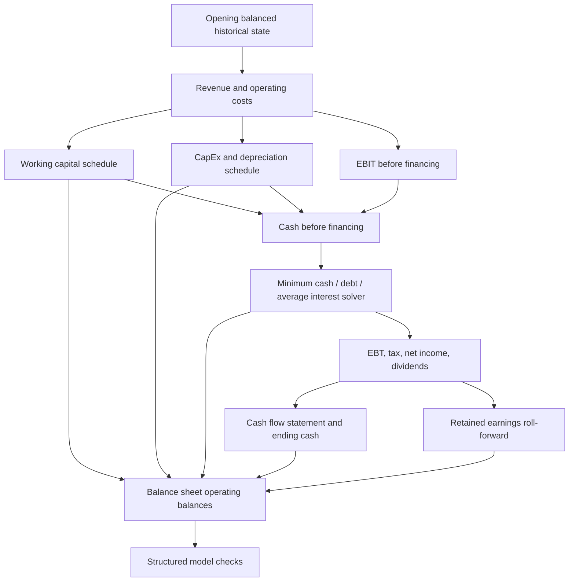

# Three-Statement Linkage

Share issuance and repurchases are explicit financing assumptions. They flow through cash
from financing and the contributed-equity roll-forward; repurchases are never hidden in a
cash plug or retained earnings.

## Forecast order

## Income statement

The default top-down model calculates revenue from prior revenue and a visible growth assumption. COGS, SG&A, and R&D are forecast as percentages of revenue. EBITDA precedes depreciation; EBIT equals EBITDA less depreciation. Interest comes only from the debt schedule. Taxes are applied to positive EBT in the MVP; tax-loss carryforwards and deferred tax schedules are future extensions.

## Working capital

- Accounts receivable = revenue × DSO / 365.
- Inventory = COGS × DIO / 365.
- Accounts payable = COGS × DPO / 365.
- Other current assets and accrued liabilities use revenue percentage drivers.
- Net working capital = AR + inventory + other current assets − AP − accrued liabilities.
- Change in NWC is the current balance less the previous period and reduces CFO when positive.

## PP&E

Ending PP&E equals beginning PP&E plus CapEx less depreciation and asset disposals. CapEx uses a revenue driver; depreciation uses beginning PP&E. Useful life and residual value are retained assumptions for the future asset-vintage implementation and are not silently substituted into the aggregate method.

## Debt, cash, and interest

The engine first calculates cash before interest and financing. Planned borrowing and repayment are applied, then additional short-term borrowing is drawn when ending cash would fall below the minimum-cash requirement. Interest uses average beginning and ending debt. The solver repeats only the incremental interest/borrowing calculation until tolerance or the maximum iteration count is reached.

## Retained earnings and cash flow

- Ending retained earnings = beginning retained earnings + net income attributable to parent − dividends.
- CFO = net income + depreciation − change in NWC.
- CFI = −CapEx + asset disposal proceeds in the aggregate MVP.
- CFF = debt issuance − debt repayment − dividends.
- Ending cash = beginning cash + CFO + CFI + CFF.

## Balance sheet

Ending cash, working-capital accounts, PP&E, debt, and retained earnings are schedule-driven. Static opening aggregates represent non-modelled assets, non-modelled liabilities, and contributed equity. Because every modelled balance change has a corresponding cash-flow or equity effect, the balance sheet reconciles without a plug.

## Required checks

For every forecast year the engine returns actual, expected, difference, tolerance, status, severity, message, and period context for:

- Assets = liabilities + equity.
- CFS ending cash = balance sheet cash.
- Beginning cash + net change = ending cash.
- Retained earnings roll-forward.
- PP&E roll-forward.
- Debt roll-forward.
- Debt/interest solver convergence.
